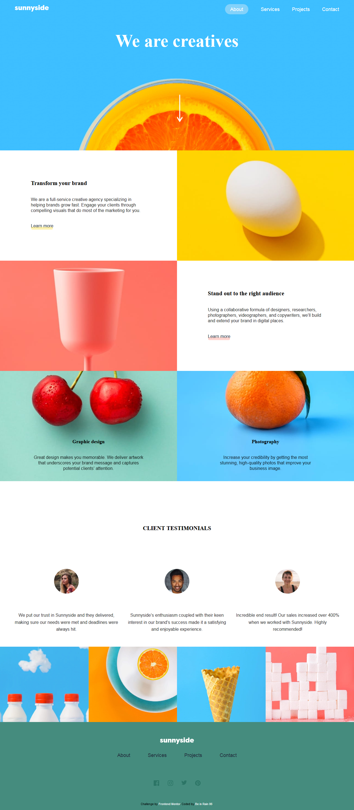
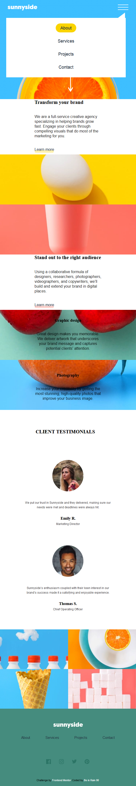

# Frontend Mentor - Sunnyside agency landing page solution

This is a solution to the [Sunnyside agency landing page challenge on Frontend Mentor](https://www.frontendmentor.io/challenges/sunnyside-agency-landing-page-7yVs3B6ef). Frontend Mentor challenges help you improve your coding skills by building realistic projects.

## Table of contents

- [Overview](#overview)
  - [The challenge](#the-challenge)
  - [Screenshot](#screenshot)
  - [Links](#links)
- [My process](#my-process)
  - [Built with](#built-with)
  - [What I learned](#what-i-learned)
  - [Continued development](#continued-development)
  - [Useful resources](#useful-resources)
- [Author](#author)


## Overview

Sunnyside is an agence mostly specialized in *marketing* and *training* *strategy*, to help theirs customers  grow or build their own company  with easiness.
They outline topics from how to **transform your Brand** , **Stand out the Right Audience**, with such keen tools like Art Design and Photography. 

### The challenge

In this Project Users should be able to:

- View the optimal layout for the site depending on their device's screen size
- See hover states for all interactive elements on the page

### Screenshot






### Links

- Solution URL: [https://github.com/BeinRain06/Sunnyside-landing-page.git]
- Live Site URL: [https://beinrain06.github.io/Sunnyside-landing-page/]

## My process

### Built with

- Semantic HTML5 markup
- Flexbox
- CSS Grid
- Javascript


### What I learned

This project helps me review my layout knowledges using both CSS Grid and Flexbox tools.
In the navigation bar of the `mobile screen`, i knocked my head trying to build `hamburger menu responsiveness` with css, and then, i notice that it could be done only with *javascript* like said in the presentation of the project in the *FrontEnDMentor Platform* , due to the `input:chechbox` behaviour that doesn't allow his `unchecked` property.


here below is my snippet javascript code to `hamburger menu responsiveness` :  :


```js

doc.addEventListener('click', triggerMenu);

function triggerMenu(e){  
  j= parseInt(e.target.value); 
  k= j % 2;
  console.log(k);

  
  if(checkbox.checked === true && k=== 0){
    menu.style.display='flex';
    arrowBurger.style.display='block';
    console.log(e.target.value);
    j= j+1;
    e.target.value= j;

  }else if(  checkbox.checked === true && k=== 1) {
    menu.style.display='none';
    arrowBurger.style.display='none';
    j= j+1;
    e.target.value= j;
  
  }

}
```


### Continued development

After this project, i wish to see how to make **hovered sophisticated animations** styles on pictures , and later on also like to sse if possible how to create **hovered animations with pictures out their Original Box**.


### Useful resources

- [https://www.w3schools.com/howto/howto_js_display_checkbox_tzxt.asp] - These notes help me figure out how to make a working hamburger Menu style with javascript. **w3Schools**  teach code for free , or paid till the procurement of certificates. The way is done is  comfortable and reliable. It is and amazing and a great website resource  for Developers.


## Author

- Website - [Ngouend Raoul Gerard](https://www.your-site.com)
- Frontend Mentor - [@BeinRain06](https://www.frontendmentor.io/profile/yourusername)
- Twitter - [@nest_Ngoueni](https://www.twitter.com/yourusername)


